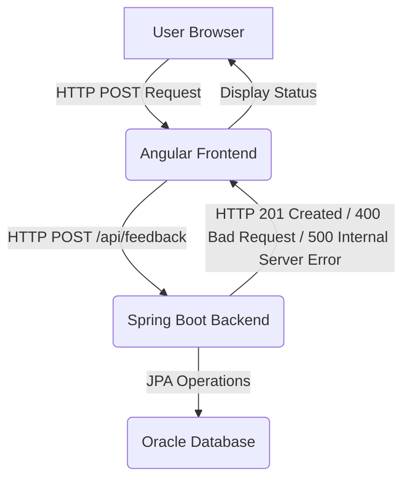

As a senior technical writer with 15 years of experience, I've thoroughly reviewed the provided code for the Feedback Submission feature. This documentation aims to provide a comprehensive guide for developers looking to understand, integrate with, and maintain this application.

---

# Application Feedback Submission Feature Documentation

## 1. Feature Overview

The Application Feedback Submission feature provides a robust and user-friendly mechanism for users to submit feedback regarding the application. This system is designed to capture user comments, suggestions, or issues, store them securely in a database, and provide immediate feedback to the user on the submission status.

**Purpose:**
To enable seamless collection of user feedback, crucial for continuous improvement and user satisfaction. It establishes a direct communication channel between users and the development team.

**Functionality:**
*   **User Interface (Frontend):** Presents a clear form where users can enter their feedback text and optionally their email address. It provides real-time client-side validation for input fields and displays submission status (submitting, success, error).
*   **API Endpoint (Backend):** Exposes a RESTful endpoint to receive feedback submissions. It performs server-side validation, sanitizes input data, and persists the feedback into a relational database.
*   **Data Persistence:** Stores feedback entries, including the feedback text, optional user email, and submission timestamp.

**High-Level Architecture:**
The feature is implemented as a single-page application (SPA) frontend built with Angular, communicating with a RESTful backend service built with Spring Boot. Data is persisted in an Oracle database.



## 2. Implementation Details

This section dives into the technical implementation of both the backend (Spring Boot) and frontend (Angular) components.

### 2.1 Backend Implementation (Spring Boot)

The backend service is a Spring Boot application responsible for handling feedback submission requests, validating data, performing sanitization, and persisting information to the database.

#### 2.1.1 Project Configuration (`pom.xml`)

The `pom.xml` defines the project's dependencies and build configuration.

*   **Parent Project:** `spring-boot-starter-parent` version `3.1.5` manages transitive dependencies and provides Spring Boot's conventions.
*   **Dependencies:**
    *   `spring-boot-starter-data-jpa`: Enables Spring Data JPA for easy database interaction.
    *   `spring-boot-starter-web`: Provides functionalities for building RESTful APIs (Spring MVC, Tomcat).
    *   `spring-boot-starter-validation`: Integrates Jakarta Bean Validation API for declarative data validation.
    *   `ojdbc8`: The official Oracle JDBC driver for connecting to Oracle databases. Configured with `scope=runtime` as it's typically only needed at runtime.
    *   `h2`: An in-memory database, included for local development and testing purposes. Also `scope=runtime`.
    *   `lombok`: A library that reduces boilerplate code by auto-generating getters, setters, constructors, etc., via annotations.
    *   `spring-boot-starter-test`: For writing unit and integration tests.
*   **Build Plugin:** `spring-boot-maven-plugin` creates an executable JAR. It's configured to exclude Lombok from the final JAR as its annotations are processed at compile time.

```xml
<!-- backend/pom.xml -->
<project>
    <!-- ... snip ... -->
    <dependencies>
        <dependency>
            <groupId>org.springframework.boot</groupId>
            <artifactId>spring-boot-starter-data-jpa</artifactId>
        </dependency>
        <dependency>
            <groupId>org.springframework.boot</groupId>
            <artifactId>spring-boot-starter-web</artifactId>
        </dependency>
        <dependency>
            <groupId>org.springframework.boot</groupId>
            <artifactId>spring-boot-starter-validation</artifactId>
        </dependency>
        <dependency>
            <groupId>com.oracle.database.jdbc</groupId>
            <artifactId>ojdbc8</artifactId>
            <scope>runtime</scope>
        </dependency>
        <dependency>
            <groupId>com.h2database</groupId>
            <artifactId>h2</artifactId>
            <scope>runtime</scope>
        </dependency>
        <dependency>
            <groupId>org.projectlombok</groupId>
            <artifactId>lombok</artifactId>
            <optional>true</optional>
        </dependency>
        <dependency>
            <groupId>org.springframework.boot</groupId>
            <artifactId>spring-boot-starter-test</artifactId>
            <scope>test</scope>
        </dependency>
    </dependencies>
    <!-- ... snip ... -->
</project>
```

#### 2.1.2 Application Entry Point (`FeedbackSubmissionApplication.java`)

This is the standard main class for a Spring Boot application. The `@SpringBootApplication` annotation combines `@Configuration`, `@EnableAutoConfiguration`, and `@ComponentScan` for convenient setup.

```java
// backend/src/main/java/com/example/feedbacksubmission/FeedbackSubmissionApplication.java
package com.example.feedbacksubmission;

import org.springframework.boot.SpringApplication;
import org.springframework.boot.autoconfigure.SpringBootApplication;

@SpringBootApplication
public class FeedbackSubmissionApplication {
    public static void main(String[] args) {
        SpringApplication.run(FeedbackSubmissionApplication.class, args);
    }
}
```

#### 2.1.3 Data Model (`model/Feedback.java`)

The `Feedback` class represents the entity stored in the database. It is mapped to the `feedback` table.

*   `@Entity`, `@Table(name = "feedback")`: Marks the class as a JPA entity and maps it to the `feedback` table.
*   `@Data`, `@NoArgsConstructor`, `@AllArgsConstructor`: Lombok annotations for boilerplate code (getters/setters, default and all-args constructors).
*   `@Id`, `@GeneratedValue`, `@SequenceGenerator`: Configures the `id` field as the primary key. `GenerationType.SEQUENCE` with `FEEDBACK_SEQ` is used for Oracle database sequence generation, ensuring unique IDs.
*   `@Column`: Defines column details:
    *   `feedbackText`: `nullable = false` and `length = 2000` enforces a maximum length and non-null constraint.
    *   `userEmail`: `length = 255`. It is nullable, aligning with the frontend's optional email field.
    *   `submissionDate`: `nullable = false`.
*   `@PrePersist`: A JPA lifecycle callback that automatically sets the `submissionDate` to the current `LocalDateTime` before a new `Feedback` entity is persisted, if not already set.

```java
// backend/src/main/java/com/example/feedbacksubmission/model/Feedback.java
package com.example.feedbacksubmission.model;

import jakarta.persistence.*;
import lombok.Data;
import lombok.NoArgsConstructor;
import lombok.AllArgsConstructor;
import java.time.LocalDateTime;

@Entity
@Table(name = "feedback")
@Data
@NoArgsConstructor
@AllArgsConstructor
public class Feedback {
    @Id
    @GeneratedValue(strategy = GenerationType.SEQUENCE, generator = "feedback_seq")
    @SequenceGenerator(name = "feedback_seq", sequenceName = "FEEDBACK_SEQ", allocationSize = 1)
    private Long id;

    @Column(name = "feedback_text", nullable = false, length = 2000)
    private String feedbackText;

    @Column(name = "user_email", length = 255) // Optional
    private String userEmail;

    @Column(name = "submission_date", nullable = false)
    private LocalDateTime submissionDate;

    @PrePersist
    protected void onCreate() {
        if (submissionDate == null) {
            submissionDate = LocalDateTime.now();
        }
    }
}
```

#### 2.1.4 Data Access (`repository/FeedbackRepository.java`)

This is a Spring Data JPA repository interface. By extending `JpaRepository<Feedback, Long>`, it automatically provides standard CRUD (Create, Read, Update, Delete) operations for the `Feedback` entity, abstracting away much of the boilerplate database access code.

```java
// backend/src/main/java/com/example/feedbacksubmission/repository/FeedbackRepository.java
package com.example.feedbacksubmission.repository;

import com.example.feedbacksubmission.model.Feedback;
import org.springframework.data.jpa.repository.JpaRepository;
import org.springframework.stereotype.Repository;

@Repository
public interface FeedbackRepository extends JpaRepository<Feedback, Long> {
}
```

#### 2.1.5 Data Transfer Object (`dto/FeedbackRequest.java`)

The `FeedbackRequest` class serves as a Data Transfer Object (DTO) for incoming JSON payloads from the frontend. It's used to deserialize the request body and apply server-side validation.

*   `@Data`, `@NoArgsConstructor`, `@AllArgsConstructor`: Lombok annotations for convenience.
*   **Validation Annotations (Jakarta Bean Validation):**
    *   `@NotBlank(message = "Feedback text cannot be empty.")`: Ensures the `feedbackText` is not null, empty, or just whitespace.
    *   `@Size(min = 10, max = 2000, message = "Feedback text must be between 10 and 2000 characters.")`: Enforces length constraints.
    *   `@Email(message = "Invalid email format.", regexp = "^$|^[a-zA-Z0-9._%+-]+@[a-zA-Z0-9.-]+\\.[a-zA-Z]{2,6}$")`: Validates the `userEmail` format. The regex `^$|^[a-zA-Z0-9._%+-]+@[a-zA-Z0-9.-]+\\.[a-zA-Z]{2,6}$` is important here as it allows for an empty string (`^$`) for optional emails, or a valid email format.
    *   `@Size(max = 255, message = "Email address cannot exceed 255 characters.")`: Limits email length.

```java
// backend/src/main/java/com/example/feedbacksubmission/dto/FeedbackRequest.java
package com.example.feedbacksubmission.dto;

import jakarta.validation.constraints.NotBlank;
import jakarta.validation.constraints.Size;
import jakarta.validation.constraints.Email;
import lombok.Data;
import lombok.NoArgsConstructor;
import lombok.AllArgsConstructor;

@Data
@NoArgsConstructor
@AllArgsConstructor
public class FeedbackRequest {
    @NotBlank(message = "Feedback text cannot be empty.")
    @Size(min = 10, max = 2000, message = "Feedback text must be between 10 and 2000 characters.")
    private String feedbackText;

    @Email(message = "Invalid email format.", regexp = "^$|^[a-zA-Z0-9._%+-]+@[a-zA-Z0-9.-]+\\.[a-zA-Z]{2,6}$")
    @Size(max = 255, message = "Email address cannot exceed 255 characters.")
    private String userEmail; // Optional, so no @NotBlank
}
```

#### 2.1.6 Business Logic (`service/FeedbackService.java`)

The `FeedbackService` class encapsulates the business logic for feedback submission.

*   `@Service`: Marks this class as a Spring service component.
*   `submitFeedback` method:
    *   Takes a `FeedbackRequest` DTO as input.
    *   **Input Sanitization:** Uses `HtmlUtils.htmlEscape` from Spring's `spring-web` module to escape HTML characters in `feedbackText` and `userEmail`. This is a basic form of defense against Cross-Site Scripting (XSS) when the data is later rendered.
        *   **Important Caveat:** While `HtmlUtils.htmlEscape` is useful for display, for comprehensive protection against various injection attacks and to ensure malicious content is not stored, a more robust HTML sanitization library (e.g., OWASP Java HTML Sanitizer) should be used, especially if feedback content is ever displayed directly without further processing or if it can contain complex HTML. The `pom.xml` includes a commented-out dependency for `OWASP ESAPI` as a reference.
    *   Creates a `Feedback` entity, populating its fields with the sanitized data from the request.
    *   Sets `submissionDate` (though `@PrePersist` in the entity also handles this).
    *   `@Transactional`: Ensures that the `save` operation is atomic. If an error occurs during saving, the transaction will be rolled back.
    *   Persists the `Feedback` entity using the `feedbackRepository.save()` method.

```java
// backend/src/main/java/com/example/feedbacksubmission/service/FeedbackService.java
package com.example.feedbacksubmission.service;

import com.example.feedbacksubmission.dto.FeedbackRequest;
import com.example.feedbacksubmission.model.Feedback;
import com.example.feedbacksubmission.repository.FeedbackRepository;
import org.springframework.stereotype.Service;
import org.springframework.transaction.annotation.Transactional;
import org.springframework.web.util.HtmlUtils; // For basic HTML escaping

import java.time.LocalDateTime;

@Service
public class FeedbackService {
    private final FeedbackRepository feedbackRepository;

    public FeedbackService(FeedbackRepository feedbackRepository) {
        this.feedbackRepository = feedbackRepository;
    }

    @Transactional
    public Feedback submitFeedback(FeedbackRequest request) {
        // Sanitize input data to prevent XSS and other injection attacks.
        String sanitizedFeedbackText = HtmlUtils.htmlEscape(request.getFeedbackText().trim());
        String sanitizedUserEmail = request.getUserEmail() != null ? HtmlUtils.htmlEscape(request.getUserEmail().trim()) : null;

        Feedback feedback = new Feedback();
        feedback.setFeedbackText(sanitizedFeedbackText);
        feedback.setUserEmail(sanitizedUserEmail);
        feedback.setSubmissionDate(LocalDateTime.now()); // Can also rely solely on @PrePersist

        return feedbackRepository.save(feedback);
    }
}
```

#### 2.1.7 REST API Controller (`controller/FeedbackController.java`)

This controller exposes the API endpoint for feedback submission.

*   `@RestController`: Marks this class as a REST controller, implying `@Controller` and `@ResponseBody`.
*   `@RequestMapping("/api")`: All endpoints in this controller will be prefixed with `/api`.
*   `@PostMapping("/feedback")`: Maps HTTP POST requests to `/api/feedback` to the `submitFeedback` method.
*   `@Valid @RequestBody FeedbackRequest request`:
    *   `@RequestBody`: Instructs Spring to deserialize the incoming JSON request body into a `FeedbackRequest` object.
    *   `@Valid`: Triggers the validation defined in `FeedbackRequest` using Jakarta Bean Validation. If validation fails, a `MethodArgumentNotValidException` is thrown, which is caught by the `GlobalExceptionHandler`.
*   **Error Handling:** A `try-catch` block is used to catch generic exceptions during feedback submission and return a `500 Internal Server Error`. For `MethodArgumentNotValidException`, the `GlobalExceptionHandler` provides a more detailed `400 Bad Request` response.
*   **Logging:** Uses SLF4J for logging request reception and submission status.

```java
// backend/src/main/java/com/example/feedbacksubmission/controller/FeedbackController.java
package com.example.feedbacksubmission.controller;

import com.example.feedbacksubmission.dto.FeedbackRequest;
import com.example.feedbacksubmission.model.Feedback;
import com.example.feedbacksubmission.service.FeedbackService;
import jakarta.validation.Valid;
import org.springframework.http.HttpStatus;
import org.springframework.http.ResponseEntity;
import org.springframework.web.bind.annotation.*;
import org.slf4j.Logger;
import org.slf4j.LoggerFactory;

@RestController
@RequestMapping("/api")
public class FeedbackController {
    private static final Logger logger = LoggerFactory.getLogger(FeedbackController.class);
    private final FeedbackService feedbackService;

    public FeedbackController(FeedbackService feedbackService) {
        this.feedbackService = feedbackService;
    }

    @PostMapping("/feedback")
    public ResponseEntity<Feedback> submitFeedback(@Valid @RequestBody FeedbackRequest request) {
        logger.info("Received feedback submission request. Feedback text length: {}, Email provided: {}",
                request.getFeedbackText().length(), request.getUserEmail() != null);
        try {
            Feedback newFeedback = feedbackService.submitFeedback(request);
            logger.info("Feedback with ID {} submitted successfully.", newFeedback.getId());
            return new ResponseEntity<>(newFeedback, HttpStatus.CREATED);
        } catch (Exception e) {
            logger.error("Error submitting feedback: {}", e.getMessage(), e);
            // In a production scenario, avoid exposing raw exception messages.
            return new ResponseEntity<>(HttpStatus.INTERNAL_SERVER_ERROR);
        }
    }
}
```

#### 2.1.8 Global Configuration (`config/WebConfig.java`)

This configuration class handles Cross-Origin Resource Sharing (CORS) settings, essential for allowing the frontend application (which typically runs on a different port or domain) to communicate with the backend.

*   `@Configuration`: Marks this class as a source of bean definitions.
*   `WebMvcConfigurer`: Interface for customizing Spring MVC configuration.
*   `addCorsMappings`: Configures CORS for all endpoints under `/api/**`.
    *   `allowedOrigins`: Specifies the origins allowed to make requests. `http://localhost:4200` is for the Angular development server. `http://your-frontend-domain.com` should be replaced with the actual production frontend domain.
    *   `allowedMethods`: Defines permitted HTTP methods.
    *   `allowedHeaders`: Allows all headers.
    *   `allowCredentials(true)`: Enables support for credentials (e.g., cookies, HTTP authentication) with cross-origin requests.

```java
// backend/src/main/java/com/example/feedbacksubmission/config/WebConfig.java
package com.example.feedbacksubmission.config;

import org.springframework.context.annotation.Configuration;
import org.springframework.web.servlet.config.annotation.CorsRegistry;
import org.springframework.web.servlet.config.annotation.WebMvcConfigurer;

@Configuration
public class WebConfig implements WebMvcConfigurer {
    @Override
    public void addCorsMappings(CorsRegistry registry) {
        registry.addMapping("/api/**") // Apply CORS to all /api endpoints
                .allowedOrigins("http://localhost:4200", "http://your-frontend-domain.com") // Replace with your Angular app's URL
                .allowedMethods("GET", "POST", "PUT", "DELETE", "OPTIONS")
                .allowedHeaders("*")
                .allowCredentials(true);
    }
}
```

#### 2.1.9 Centralized Exception Handling (`exception/GlobalExceptionHandler.java`)

This class provides a centralized mechanism to handle exceptions thrown by controllers, ensuring consistent error responses.

*   `@ControllerAdvice`: A specialization of `@Component` that allows handling exceptions across the whole application.
*   `handleValidationExceptions`: Catches `MethodArgumentNotValidException` (thrown when `@Valid` validation fails). It extracts field-specific error messages and returns them as a `Map<String, String>` with `HttpStatus.BAD_REQUEST (400)`.
*   `handleGenericException`: Catches any other uncaught `Exception`, returning a generic `500 Internal Server Error` message to prevent exposing sensitive internal details.

```java
// backend/src/main/java/com/example/feedbacksubmission/exception/GlobalExceptionHandler.java
package com.example.feedbacksubmission.exception;

import org.springframework.http.HttpStatus;
import org.springframework.http.ResponseEntity;
import org.springframework.web.bind.MethodArgumentNotValidException;
import org.springframework.web.bind.annotation.ControllerAdvice;
import org.springframework.web.bind.annotation.ExceptionHandler;
import org.springframework.web.bind.annotation.ResponseStatus;

import java.util.HashMap;
import java.util.Map;

@ControllerAdvice
public class GlobalExceptionHandler {
    @ExceptionHandler(MethodArgumentNotValidException.class)
    @ResponseStatus(HttpStatus.BAD_REQUEST)
    public ResponseEntity<Map<String, String>> handleValidationExceptions(MethodArgumentNotValidException ex) {
        Map<String, String> errors = new HashMap<>();
        ex.getBindingResult().getFieldErrors().forEach(error ->
                errors.put(error.getField(), error.getDefaultMessage()));
        return new ResponseEntity<>(errors, HttpStatus.BAD_REQUEST);
    }

    @ExceptionHandler(Exception.class)
    @ResponseStatus(HttpStatus.INTERNAL_SERVER_ERROR)
    public ResponseEntity<String> handleGenericException(Exception ex) {
        return new ResponseEntity<>("An unexpected error occurred. Please try again later.", HttpStatus.INTERNAL_SERVER_ERROR);
    }
}
```

#### 2.1.10 Database Configuration (`application.properties`)

This file configures the Spring Boot application's properties, including the server port and database connection details.

*   `server.port`: Specifies the port on which the Spring Boot application will run (defaulting to 8080).
*   **Oracle Database Configuration:**
    *   `spring.datasource.url`: JDBC URL for the Oracle database.
    *   `spring.datasource.username`, `spring.datasource.password`: Credentials for database access. **Remember to replace `your_db_username` and `your_db_password` with actual credentials.**
    *   `spring.datasource.driver-class-name`: Specifies the Oracle JDBC driver class.
*   **JPA/Hibernate Configuration:**
    *   `spring.jpa.hibernate.ddl-auto=update`: Hibernate will update the schema based on entities. **Caution:** This setting is suitable for development/testing but should generally be set to `none` or `validate` in production, with schema changes managed via dedicated migration tools (e.g., Flyway, Liquibase).
    *   `spring.jpa.database-platform`: Specifies the Hibernate dialect for Oracle.
    *   `spring.jpa.show-sql=true`, `spring.jpa.properties.hibernate.format_sql=true`: Enables logging of SQL statements and formats them for readability, useful for debugging.

```properties
# backend/src/main/resources/application.properties
server.port=8080

spring.datasource.url=jdbc:oracle:thin:@localhost:1521:xe
spring.datasource.username=your_db_username
spring.datasource.password=your_db_password
spring.datasource.driver-class-name=oracle.jdbc.OracleDriver

spring.jpa.hibernate.ddl-auto=update
spring.jpa.database-platform=org.hibernate.dialect.OracleDialect
spring.jpa.show-sql=true
spring.jpa.properties.hibernate.format_sql=true

# For enabling H2 console if using H2 for testing (can be commented out in production)
# spring.h2.console.enabled=true
# spring.h2.console.path=/h2-console
```

#### 2.1.11 Backend Tests

Unit and integration tests ensure the backend logic functions correctly and the API endpoints behave as expected.

*   **`FeedbackServiceTest.java`**: Uses `MockitoExtension` to mock the `FeedbackRepository` and test the `FeedbackService` in isolation. It verifies successful submission, input sanitization, and handling of optional fields.
*   **`FeedbackControllerTest.java`**: Uses `@WebMvcTest` to test the `FeedbackController` without starting the full Spring application context. It mocks the `FeedbackService` and uses `MockMvc` to send HTTP requests, asserting on response statuses (e.g., `201 Created`, `400 Bad Request`, `500 Internal Server Error`) and JSON content, verifying both success and validation error scenarios.

### 2.2 Frontend Implementation (Angular)

The frontend is an Angular application that provides the user interface for submitting feedback and interacts with the Spring Boot backend.

#### 2.2.1 Project Configuration (`package.json`, `angular.json`)

These are standard Angular CLI-generated files:

*   `package.json`: Manages project dependencies (Angular core, forms, HTTP client, RxJS, etc.) and scripts for building, serving, and testing.
*   `angular.json`: Configures the Angular workspace, including project settings, build options, and test configurations.

#### 2.2.2 Root Module (`app.module.ts`)

The main Angular module for the application.

*   `BrowserModule`: Required for running Angular apps in a browser.
*   `ReactiveFormsModule`: Provides the necessary services and directives for building reactive forms, which are used for the feedback form.
*   `HttpClientModule`: Provides Angular's `HttpClient` service for making HTTP requests to the backend API.
*   Declares `AppComponent` and `FeedbackFormComponent`.

```typescript
// frontend/src/app/app.module.ts
import { NgModule } from '@angular/core';
import { BrowserModule } from '@angular/platform-browser';
import { ReactiveFormsModule } from '@angular/forms';
import { HttpClientModule } from '@angular/common/http';

import { AppComponent } from './app.component';
import { FeedbackFormComponent } from './feedback-form/feedback-form.component';

@NgModule({
  declarations: [
    AppComponent,
    FeedbackFormComponent
  ],
  imports: [
    BrowserModule,
    ReactiveFormsModule, // For reactive forms
    HttpClientModule     // For making HTTP requests
  ],
  providers: [],
  bootstrap: [AppComponent]
})
export class AppModule { }
```

#### 2.2.3 Feedback Form Component (`feedback-form.component.ts`, `.html`, `.css`)

This component is the core of the user interface for feedback submission.

*   **`feedback-form.component.ts`**:
    *   `FormBuilder`, `FormGroup`, `Validators`: Used to create and manage the reactive form.
    *   **Client-Side Validation:**
        *   `Validators.required`: For `feedbackText`.
        *   `Validators.minLength(10)`, `Validators.maxLength(2000)`: For `feedbackText`.
        *   `Validators.email`, `Validators.maxLength(255)`: For `userEmail`.
        *   Client-side validation provides immediate user feedback, improving user experience before a network round trip.
    *   `submissionStatus`: A state variable (`'idle'`, `'submitting'`, `'success'`, `'error'`) that controls the UI's display of form status.
    *   `onSubmit()`: Handles form submission. It performs client-side validation, and if valid, calls `FeedbackService.submitFeedback()`.
    *   **Error Handling:** It subscribes to the service's observable. On success, it resets the form and sets status to `success`. On error, it sets status to `error` and captures backend validation errors to display them against the respective form fields, or a generic error message otherwise.
    *   `onCancel()`: Resets the form.
*   **`feedback-form.component.html`**:
    *   Uses Angular's reactive form directives (`[formGroup]`, `formControlName`).
    *   Displays validation error messages using `*ngIf` based on form control validity (`invalid`, `dirty`, `touched`).
    *   Conditionally renders submission status messages (`alert alert-danger`, `alert alert-success`).
    *   Disables the submit button while submitting or if the form is invalid.
*   **`feedback-form.component.css`**: Provides basic styling for the form elements, making it visually appealing and user-friendly.

```typescript
// frontend/src/app/feedback-form/feedback-form.component.ts
import { Component, OnInit } from '@angular/core';
import { FormBuilder, FormGroup, Validators } from '@angular/forms';
import { FeedbackService } from '../services/feedback.service';

@Component({
  selector: 'app-feedback-form',
  templateUrl: './feedback-form.component.html',
  styleUrls: ['./feedback-form.component.css']
})
export class FeedbackFormComponent implements OnInit {
  feedbackForm!: FormGroup;
  submissionStatus: 'idle' | 'submitting' | 'success' | 'error' = 'idle';
  errorMessage: string = '';

  constructor(
    private fb: FormBuilder,
    private feedbackService: FeedbackService
  ) { }

  ngOnInit(): void {
    this.initForm();
  }

  initForm(): void {
    this.feedbackForm = this.fb.group({
      feedbackText: ['', [
        Validators.required,
        Validators.minLength(10),
        Validators.maxLength(2000)
      ]],
      userEmail: ['', [
        Validators.email,
        Validators.maxLength(255)
      ]]
    });
    this.submissionStatus = 'idle';
    this.errorMessage = '';
  }

  get f() { return this.feedbackForm.controls; }

  onSubmit(): void {
    this.submissionStatus = 'submitting';
    this.errorMessage = '';

    if (this.feedbackForm.invalid) {
      this.submissionStatus = 'error';
      this.errorMessage = 'Please correct the highlighted errors in the form.';
      this.feedbackForm.markAllAsTouched();
      return;
    }

    const { feedbackText, userEmail } = this.feedbackForm.value;

    this.feedbackService.submitFeedback(feedbackText, userEmail)
      .subscribe({
        next: (response) => {
          console.log('Feedback submitted successfully:', response);
          this.submissionStatus = 'success';
          this.feedbackForm.reset();
        },
        error: (error) => {
          console.error('Error submitting feedback:', error);
          this.submissionStatus = 'error';
          if (error.status === 400 && error.error) {
            const backendErrors = error.error;
            for (const key in backendErrors) {
              if (this.feedbackForm.controls[key]) {
                this.feedbackForm.controls[key].setErrors({ backendError: backendErrors[key] });
              }
            }
            this.errorMessage = 'Please correct the server-side validation errors.';
          } else {
            this.errorMessage = 'Failed to submit feedback. Please try again later.';
          }
        }
      });
  }

  onCancel(): void {
    console.log('Feedback submission cancelled.');
    this.initForm();
  }
}
```

```html
<!-- frontend/src/app/feedback-form/feedback-form.component.html -->
<div class="feedback-container">
  <h2>Provide Your Feedback</h2>
  <form [formGroup]="feedbackForm" (ngSubmit)="onSubmit()">
    <div class="form-group">
      <label for="feedbackText">Feedback Text <span class="required">*</span>:</label>
      <textarea id="feedbackText" formControlName="feedbackText" rows="5"
                placeholder="Share your thoughts on the application..."></textarea>
      <div *ngIf="f['feedbackText'].invalid && (f['feedbackText'].dirty || f['feedbackText'].touched)" class="error-message">
        <div *ngIf="f['feedbackText'].errors?.['required']">Feedback text is required.</div>
        <div *ngIf="f['feedbackText'].errors?.['minlength']">Feedback text must be at least 10 characters.</div>
        <div *ngIf="f['feedbackText'].errors?.['maxlength']">Feedback text cannot exceed 2000 characters.</div>
        <div *ngIf="f['feedbackText'].errors?.['backendError']">{{f['feedbackText'].errors['backendError']}}</div>
      </div>
    </div>

    <div class="form-group">
      <label for="userEmail">Your Email (Optional):</label>
      <input type="email" id="userEmail" formControlName="userEmail" placeholder="your.email@example.com">
      <div *ngIf="f['userEmail'].invalid && (f['userEmail'].dirty || f['userEmail'].touched)" class="error-message">
        <div *ngIf="f['userEmail'].errors?.['email']">Please enter a valid email address.</div>
        <div *ngIf="f['userEmail'].errors?.['maxlength']">Email address cannot exceed 255 characters.</div>
        <div *ngIf="f['userEmail'].errors?.['backendError']">{{f['userEmail'].errors['backendError']}}</div>
      </div>
    </div>

    <div *ngIf="submissionStatus === 'error'" class="alert alert-danger">
      {{ errorMessage }}
    </div>

    <div *ngIf="submissionStatus === 'success'" class="alert alert-success">
      Thank you for your feedback! It has been successfully submitted.
    </div>

    <div class="form-actions">
      <button type="submit" [disabled]="feedbackForm.invalid || submissionStatus === 'submitting'" class="submit-button">
        <span *ngIf="submissionStatus === 'submitting'">Submitting...</span>
        <span *ngIf="submissionStatus !== 'submitting'">Submit Feedback</span>
      </button>
      <button type="button" (click)="onCancel()" class="cancel-button">Cancel</button>
    </div>
  </form>
</div>
```

#### 2.2.4 Feedback Service (`services/feedback.service.ts`)

This is an Angular service that encapsulates the HTTP communication with the backend.

*   `@Injectable({ providedIn: 'root' })`: Makes the service a singleton and available throughout the application.
*   `HttpClient`: Angular's service for making HTTP requests.
*   `apiUrl`: Constructed from `environment.apiUrl` and the specific endpoint `/feedback`.
*   `submitFeedback()`: Sends a POST request to the backend with the feedback data. It correctly handles the optional `userEmail` by sending `null` if it's empty, ensuring the backend's optional field is handled.

```typescript
// frontend/src/app/services/feedback.service.ts
import { Injectable } from '@angular/core';
import { HttpClient } from '@angular/common/http';
import { Observable } from 'rxjs';
import { environment } from '../../environments/environment';
import { FeedbackResponse } from '../models/feedback.model';

@Injectable({
  providedIn: 'root'
})
export class FeedbackService {
  private apiUrl = `${environment.apiUrl}/feedback`; // Assuming /api/feedback

  constructor(private http: HttpClient) { }

  /**
   * Submits user feedback to the backend API.
   * @param feedbackText The mandatory text feedback.
   * @param userEmail The optional user email.
   * @returns An Observable of the HTTP response.
   */
  submitFeedback(feedbackText: string, userEmail: string | null): Observable<FeedbackResponse> {
    const payload = {
      feedbackText: feedbackText,
      userEmail: userEmail || null // Ensure null is sent for optional empty email
    };
    return this.http.post<FeedbackResponse>(this.apiUrl, payload);
  }
}
```

#### 2.2.5 Data Models (`models/feedback.model.ts`)

These TypeScript interfaces define the structure of data sent to and received from the backend, providing type safety throughout the frontend.

*   `FeedbackPayload`: Represents the request body for `POST /api/feedback`. `userEmail` is optional (`?`) and can be `null`.
*   `FeedbackResponse`: Represents the successful response body from `POST /api/feedback`, including the generated `id` and `submissionDate`.

```typescript
// frontend/src/app/models/feedback.model.ts
export interface FeedbackPayload {
  feedbackText: string;
  userEmail?: string | null;
}

export interface FeedbackResponse {
  id: number;
  feedbackText: string;
  userEmail: string | null;
  submissionDate: string; // ISO 8601 string date
}
```

#### 2.2.6 Environment Configuration (`environments/environment.ts`, `.prod.ts`)

Angular's environment files allow defining configuration variables specific to development (`environment.ts`) and production (`environment.prod.ts`). This is crucial for managing the backend API URL, which typically differs between environments.

```typescript
// frontend/src/environments/environment.ts
export const environment = {
  production: false,
  apiUrl: 'http://localhost:8080/api' // Development Backend API URL
};

// frontend/src/environments/environment.prod.ts
export const environment = {
  production: true,
  apiUrl: 'https://your-production-api-url.com/api' // Production Backend API URL
};
```

#### 2.2.7 Root Component (`app.component.ts`, `.html`, `.css`)

The root component that bootstraps the Angular application and hosts the `FeedbackFormComponent`.

```html
<!-- frontend/src/app/app.component.html -->
<div class="app-container">
  <h1>{{ title }}</h1>
  <app-feedback-form></app-feedback-form>
</div>
```

#### 2.2.8 Frontend Tests

Unit tests for frontend components and services ensure correct functionality and reliable interaction.

*   **`feedback-form.component.spec.ts`**: Tests the `FeedbackFormComponent`'s form validation (required, min/max length, email format), state changes during submission (submitting, success, error), and interaction with the `FeedbackService` using spies and mocked observables.
*   **`feedback.service.spec.ts`**: Tests the `FeedbackService` using `HttpClientTestingModule` and `HttpTestingController` to mock HTTP requests. It verifies that the service sends correct POST requests with the expected payload to the defined API URL, including handling of `null` email.

## 3. Key Interfaces and Integration Points

This section highlights the critical points where different components or systems interact.

### 3.1 REST API Endpoint

*   **Method:** `POST`
*   **Path:** `/api/feedback`
*   **Purpose:** Submit new feedback to the system.

#### 3.1.1 Request Payload

The request body should be a JSON object conforming to the `FeedbackRequest` DTO structure.

```json
{
  "feedbackText": "Your valuable feedback here. Min 10, Max 2000 characters.",
  "userEmail": "optional.email@example.com"
}
```

*   `feedbackText`: (String, **Required**) - The main feedback content. Must be between 10 and 2000 characters.
*   `userEmail`: (String, **Optional**, Nullable) - The user's email address. If provided, must be a valid email format and up to 255 characters. Can be `null` or an empty string (`""`).

#### 3.1.2 Success Response

Upon successful feedback submission, the API returns a `201 Created` HTTP status code along with the newly created `Feedback` entity.

```json
HTTP/1.1 201 Created
Content-Type: application/json

{
  "id": 12345,
  "feedbackText": "Your valuable feedback here.",
  "userEmail": "optional.email@example.com",
  "submissionDate": "2023-10-27T10:30:00.123"
}
```

#### 3.1.3 Error Responses

*   **`400 Bad Request` (Validation Errors):**
    If the request payload fails server-side validation (e.g., `feedbackText` is too short, `userEmail` is invalid), a `400 Bad Request` status is returned with a JSON object detailing the validation errors.

    ```json
    HTTP/1.1 400 Bad Request
    Content-Type: application/json

    {
      "feedbackText": "Feedback text must be between 10 and 2000 characters.",
      "userEmail": "Invalid email format."
    }
    ```

*   **`500 Internal Server Error` (Unexpected Errors):**
    For any unhandled exceptions on the server-side (e.g., database connectivity issues), a `500 Internal Server Error` is returned. The response body will contain a generic error message, avoiding exposure of internal details.

    ```json
    HTTP/1.1 500 Internal Server Error
    Content-Type: text/plain

    An unexpected error occurred. Please try again later.
    ```

### 3.2 Database Schema

The backend interacts with an Oracle database, specifically creating or updating a table named `feedback`.

*   **Table Name:** `feedback`
*   **Columns:**
    *   `ID` (NUMBER): Primary key, generated from `FEEDBACK_SEQ`.
    *   `FEEDBACK_TEXT` (VARCHAR2(2000)): Not Null. Stores the actual feedback.
    *   `USER_EMAIL` (VARCHAR2(255)): Nullable. Stores the user's email.
    *   `SUBMISSION_DATE` (TIMESTAMP): Not Null. Records when the feedback was submitted.
*   **Sequence:** `FEEDBACK_SEQ` (Oracle sequence for `ID` generation).

### 3.3 Cross-Origin Resource Sharing (CORS)

The backend is configured to accept requests from specific origins (`http://localhost:4200` for development, and `http://your-frontend-domain.com` for production). This is crucial for enabling the Angular frontend, typically served from a different origin, to successfully make requests to the Spring Boot backend. Ensure your frontend's domain is correctly configured in `WebConfig.java`.

## 4. Usage Examples

### 4.1 Submitting Feedback via REST API (cURL Example)

To test the backend API directly, you can use `curl`.

#### 4.1.1 Successful Submission

**Request:**

```bash
curl -X POST \
  http://localhost:8080/api/feedback \
  -H 'Content-Type: application/json' \
  -d '{
    "feedbackText": "The application works flawlessly and is very intuitive. Keep up the great work!",
    "userEmail": "developer@example.com"
  }'
```

**Expected Successful Response (Status: `201 Created`):**

```json
{
  "id": 1,
  "feedbackText": "The application works flawlessly and is very intuitive. Keep up the great work!",
  "userEmail": "developer@example.com",
  "submissionDate": "2023-10-27T15:30:45.123456"
}
```

#### 4.1.2 Submission with Missing Required Field (Validation Error)

**Request:**

```bash
curl -X POST \
  http://localhost:8080/api/feedback \
  -H 'Content-Type: application/json' \
  -d '{
    "feedbackText": "",
    "userEmail": "invalid-email"
  }'
```

**Expected Error Response (Status: `400 Bad Request`):**

```json
{
  "feedbackText": "Feedback text cannot be empty.",
  "userEmail": "Invalid email format."
}
```

### 4.2 Frontend Usage (User Experience)

The Angular frontend provides a simple form for users to interact with the feedback submission system.

**Steps:**

1.  Navigate to the Angular application (e.g., `http://localhost:4200`).
2.  Locate the "Provide Your Feedback" form.
3.  **Enter Feedback Text:** Type your feedback into the "Feedback Text" textarea.
    *   If you leave it empty or type less than 10 characters, client-side validation messages will appear immediately.
4.  **Enter Email (Optional):** Optionally, provide your email address in the "Your Email" input field.
    *   If you enter an invalid email format, client-side validation will prompt you to correct it.
5.  **Submit:** Click the "Submit Feedback" button.
    *   The button will show "Submitting..." while the request is in progress.
    *   On success, a "Thank you for your feedback!" message will appear, and the form will reset.
    *   On error, an "Failed to submit feedback." message will appear, and if due to validation issues, specific field errors from the backend will be displayed.
6.  **Cancel:** Click the "Cancel" button to clear the form and reset its state.

## 5. Important Considerations and Edge Cases

### 5.1 Security

*   **Input Sanitization:** The backend uses `HtmlUtils.htmlEscape` for basic HTML escaping. This helps prevent XSS vulnerabilities when displaying stored feedback *if* the output is HTML.
    *   **Caveat:** This method is a basic defense. For applications dealing with sensitive data or complex user-generated content, consider a dedicated and robust sanitization library like **OWASP Java HTML Sanitizer**. This allows for a more controlled whitelist-based sanitization, ensuring only safe HTML elements and attributes are stored and rendered.
    *   **SQL Injection:** JPA and prepared statements (used implicitly by Spring Data JPA) inherently protect against SQL injection. No specific measures are needed in application code beyond using JPA correctly.
*   **Error Message Exposure:** The `GlobalExceptionHandler` ensures that generic `500 Internal Server Error` messages do not expose sensitive internal details (e.g., stack traces) to the client in production. Detailed error logging should happen server-side only.
*   **CORS Configuration:** The `WebConfig` class configures CORS. In production, ensure `allowedOrigins` is restricted to your actual frontend domain(s) and does not include `*` (all origins) unless absolutely necessary and understood.

### 5.2 Scalability and Performance

*   **Database Indexes:** For larger datasets, consider adding database indexes to frequently queried columns. While not currently part of this feature, if you plan to search or sort feedback by `submission_date` or `user_email`, an index on these columns would significantly improve query performance.
*   **Database Connection Pooling:** Spring Boot (via Hibernate and HikariCP by default) automatically manages database connection pooling, which is crucial for performance under load. No explicit configuration is required unless specific tuning is needed.
*   **Load Balancing:** For high-traffic applications, deploy multiple instances of the Spring Boot backend behind a load balancer to distribute requests and ensure high availability.
*   **API Gateway:** In a microservices architecture, an API Gateway (as hinted in the architecture diagram) would handle request routing, authentication, rate limiting, and possibly more advanced CORS management, offloading these concerns from the individual service.

### 5.3 Database Management

*   **`spring.jpa.hibernate.ddl-auto`:** The current setting `update` automatically updates the database schema based on JPA entities. **This is suitable for development and testing environments but highly discouraged for production.** In production, use:
    *   `none`: To disable DDL generation by Hibernate.
    *   `validate`: To validate the schema against entities on startup.
    Instead, use dedicated database migration tools like **Flyway** or **Liquibase** to manage schema changes in a controlled and versioned manner.
*   **Oracle Sequence:** The `Feedback` entity uses an Oracle sequence (`FEEDBACK_SEQ`) for ID generation. Ensure this sequence exists in your Oracle database before deploying the application with `ddl-auto=none` or `validate`. If using `ddl-auto=update`, Hibernate might create it, but explicit management is safer.

### 5.4 Frontend Specifics

*   **Client-Side vs. Server-Side Validation:** The application implements both client-side (Angular) and server-side (Spring Boot) validation.
    *   **Client-side validation:** Enhances user experience by providing immediate feedback.
    *   **Server-side validation:** **Crucial for security and data integrity.** It cannot be bypassed by malicious users and ensures that only valid data reaches the database. Always rely on server-side validation for correctness.
*   **User Feedback (UI):** The `submissionStatus` variable and associated messages (`alert-success`, `alert-danger`) provide clear feedback to the user on the outcome of their submission, improving the overall user experience.
*   **Environment Configuration:** The use of `environment.ts` and `environment.prod.ts` for `apiUrl` is a best practice. Ensure the production API URL (`https://your-production-api-url.com/api`) is correctly set for your deployed environment.

### 5.5 Observability

*   **Logging:** The `FeedbackController` includes SLF4J logging for incoming requests and submission success/failure. Implement a robust logging strategy (e.g., structured logging, centralized logging) for production environments to monitor application health and troubleshoot issues effectively.

### 5.6 Future Enhancements (Not Implemented Here)

*   **Rate Limiting:** To prevent abuse of the feedback endpoint (e.g., spamming), consider implementing rate limiting at the API Gateway or within the Spring Boot application itself.
*   **Authentication/Authorization:** If feedback needs to be linked to specific authenticated users or requires certain permissions, integrate Spring Security for authentication and authorization.
*   **Notification System:** After feedback submission, integrate with a notification system (e.g., email, Slack) to alert the relevant teams.
*   **Advanced Sanitization/Moderation:** For public-facing applications, consider an automated moderation system or manual review process for feedback to filter out inappropriate content.
*   **Accessibility:** Ensure the feedback form adheres to web accessibility standards (WCAG) for users with disabilities.
*   **Internationalization (i18n):** For global applications, externalize text strings and implement i18n in both frontend and backend for validation messages.